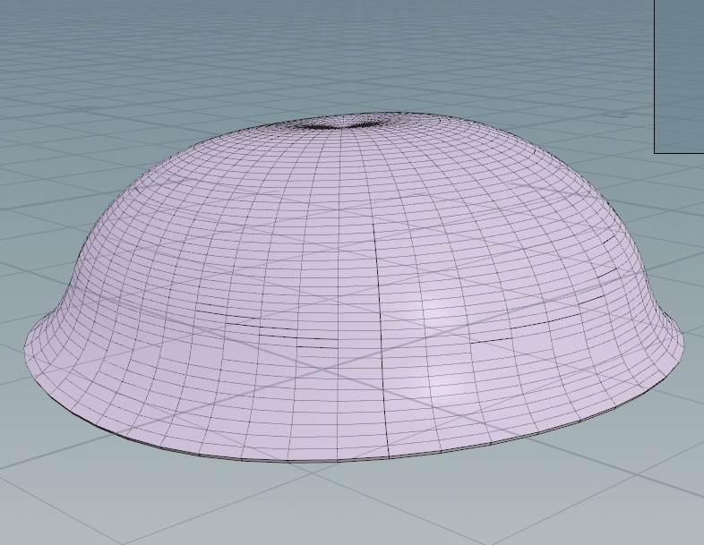
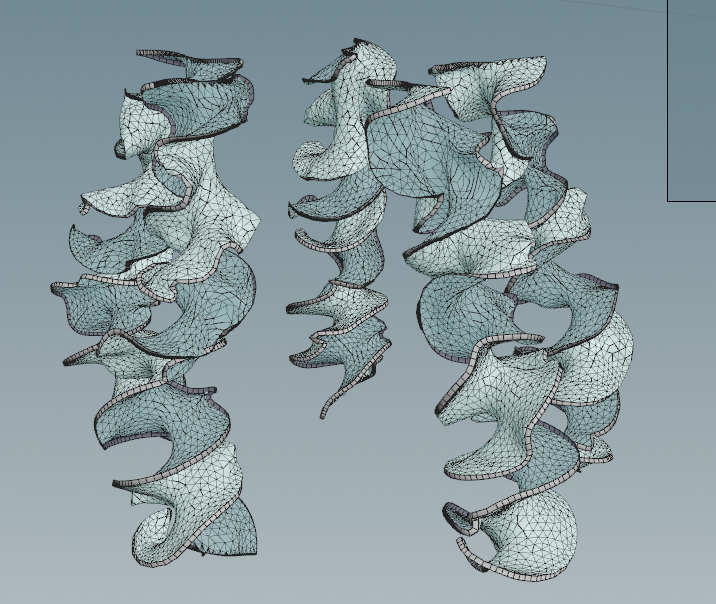
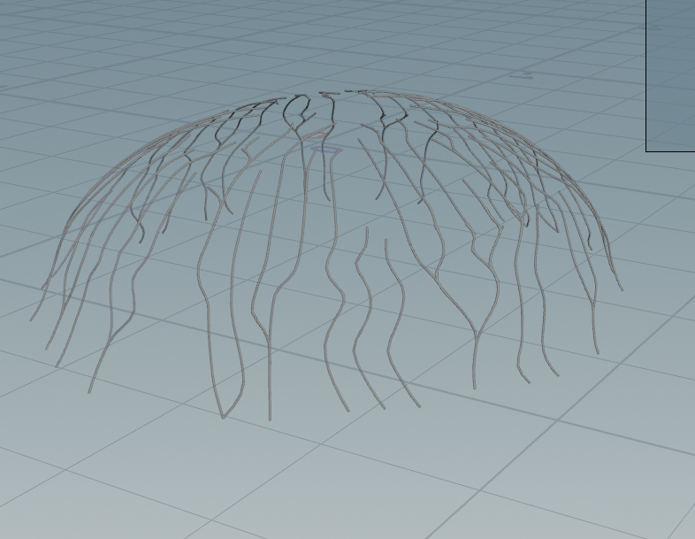
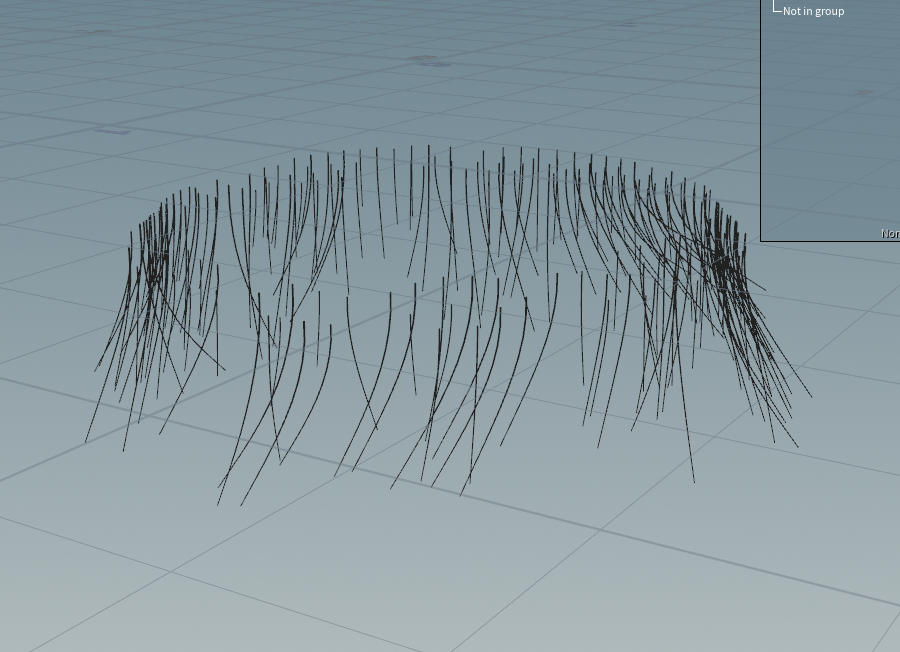
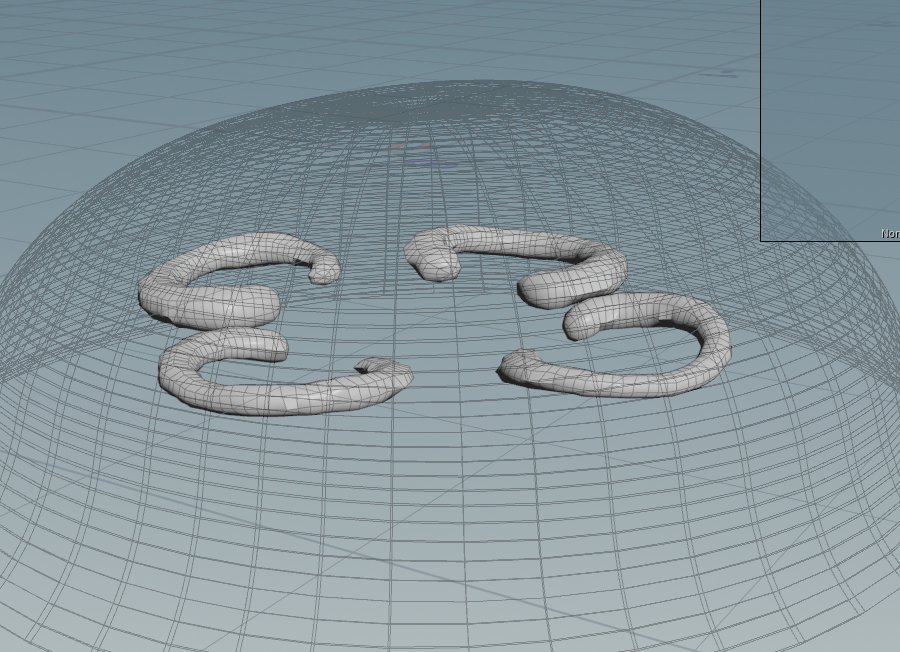

# Procedural Jellyfish

https://github.com/user-attachments/assets/8d057074-96b4-4d2b-b6e1-c9c2ca5408d2

The jellyfish is comprised of five separate pieces: the bell, arms, veins, tentacles, and organs.

## Bell

The bell is created by creating a line, bending it, and revolving it about the y axis to create the bell shape.  It is then animated by keyframing the controls.

## Arms

The arms are created by creating a long narrow grid, applying noise to the edges of it, twisting it, copying it 6 times, and applying a Vellum cloth simulation.  The arms are pinned to points that follow the bell animation.

## Veins

The veins are created by remeshing the bell into triangles, finding shortest paths between some points on the top of the bell and some points on the bottom, turning those paths into tubes, and deforming the veins so that they follow the bell's animation.

## Tentacles

The tentacles are created by scattering points on the bottom of the bell, copying lines to those points, and running a Vellum cloth simulation with repulsion and gravity forces.  Similar to the arms, the lines are pinned to points that follow the bell's animation.

## Organs

The organs are created by creating a circle curve, blasting away some points of it that fall below a certain curveu threshold, sweeping the path into a tube, applying a mountain node deformation, and copying the organs 4 times in a circle.  The organs are also deformed according to the bell's animation.
